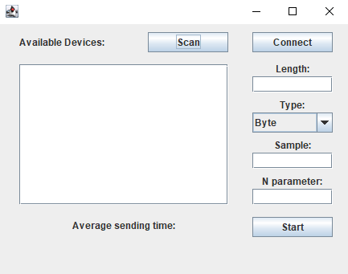
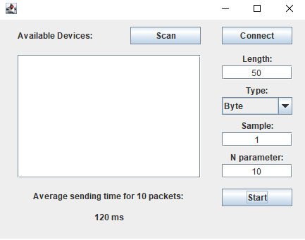

DesktopAppBle
===================================

Use the Bluetooth LE Generic Attribute Profile (GATT)
to transmit arbitrary data between devices.

Introduction
------------

DesktopAppBLE provides scanning available Bluetooth LE devices in GUI,
an interface to connect and send data. Each packet has length, sample value and type.
Average time for sending one packet in the last N successfully sent packets is shown on the GUI, 
where N is selected parameter.

Screenshots
-------------

  
